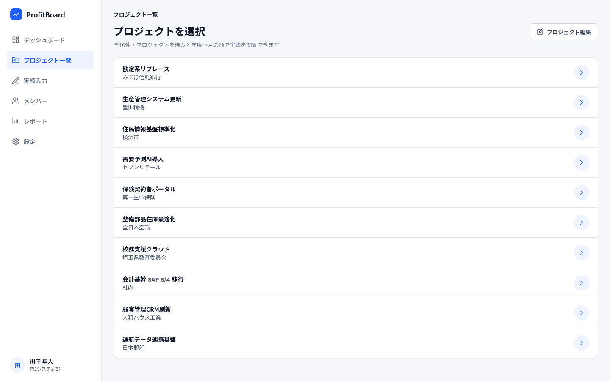
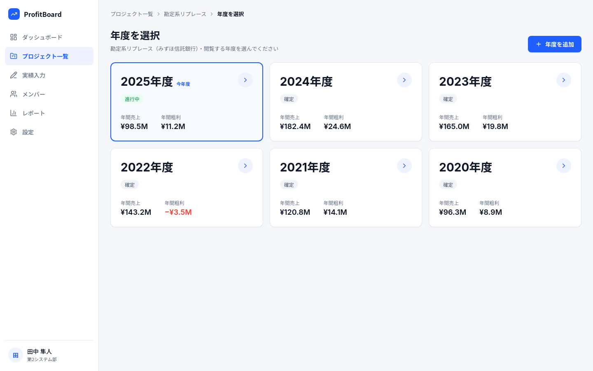
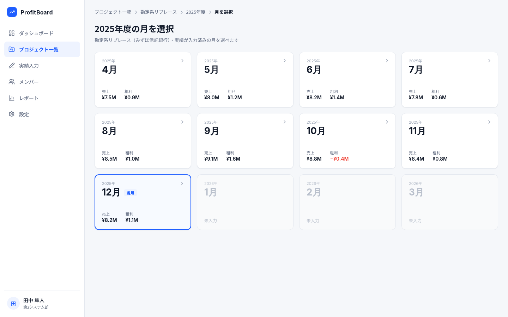
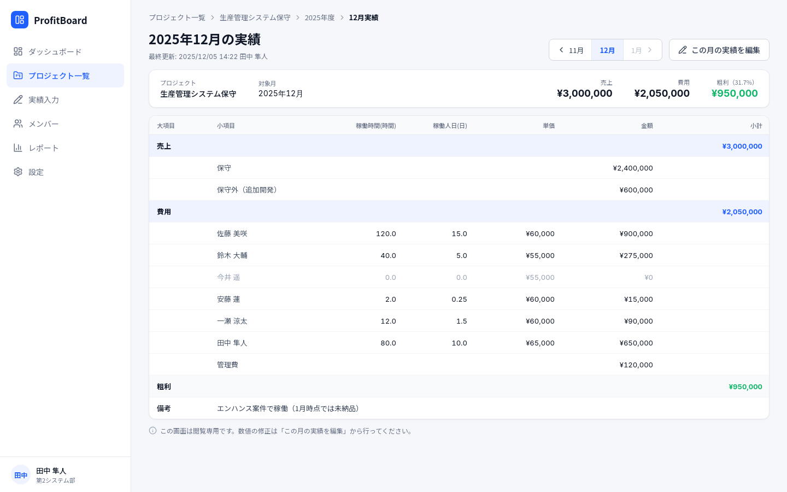

# 仕様変更(v1)

以下の内容を仕様変更したい。

## 1. 年度マスタを作成する

現在は `pages/performance/input.vue` の `FISCAL_YEAR_RANGE` でプルダウンの年度を作成しているが、
年度は今後どんどん増えていくので、DBのデータから年度プルダウンを計算するよりも、年度マスタから
取得できたほうが楽だし管理もしやすい。

## 2. 画面構成を変更する

### 2-1. ダッシュボードとプロジェクト一覧

現在はダッシュボードとプロジェクト一覧双方で営業成績を閲覧できるが、単一責務するべきなので
「営業成績を閲覧する」という機能は **ダッシュボードのみに限定** する。

プロジェクト一覧は、プロジェクト→年度→月を画面遷移でドリルダウンしていき、
実績閲覧画面に遷移することを目的とする。

### 2-2. プロジェクト一覧の導線

前述の通り、プロジェクト一覧はプロジェクト→年度→月をドリルダウンしていき、
当該プロジェクトの当該年度・月における営業実績を閲覧する画面に遷移することが目的。

そのため、画面構成を以下の通り変更する。

#### プロジェクト一覧(第1階層)

プロジェクトを選択して次の階層へ

#### 年度選択(第2階層)

年度を選択して次の階層へ

#### 月選択(第3階層)

月を選択して実績閲覧へ

#### 実績閲覧(第4階層)

選択したプロジェクト・年度・月の営業成績の実績を閲覧できる

## 3. 稼働時間の小数点

現在、稼働時間の小数点は第1位までになっているが、それを第2位までに変更する。
`t_costs` の `work_hours` が `NUMERIC(6, 1)` になっているので、 `NUMERIC(6, 2)` に変更が必要。
