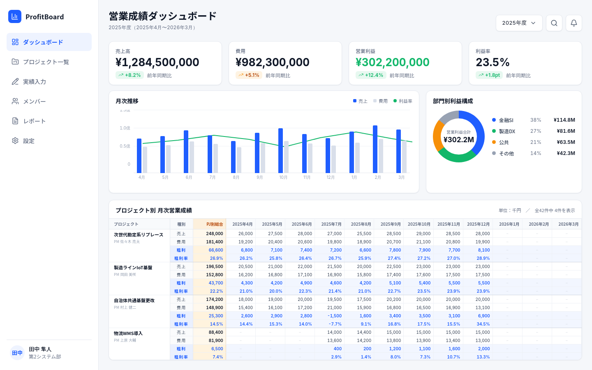
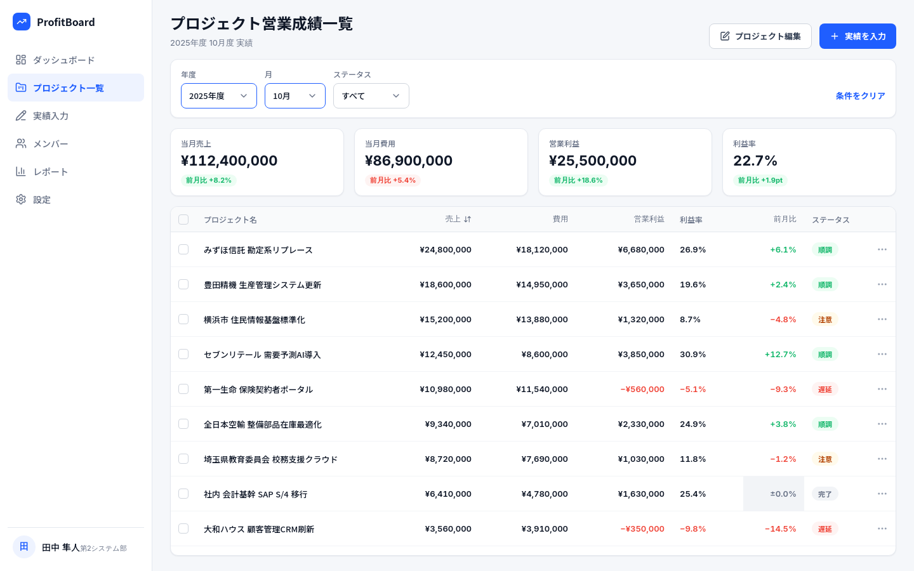
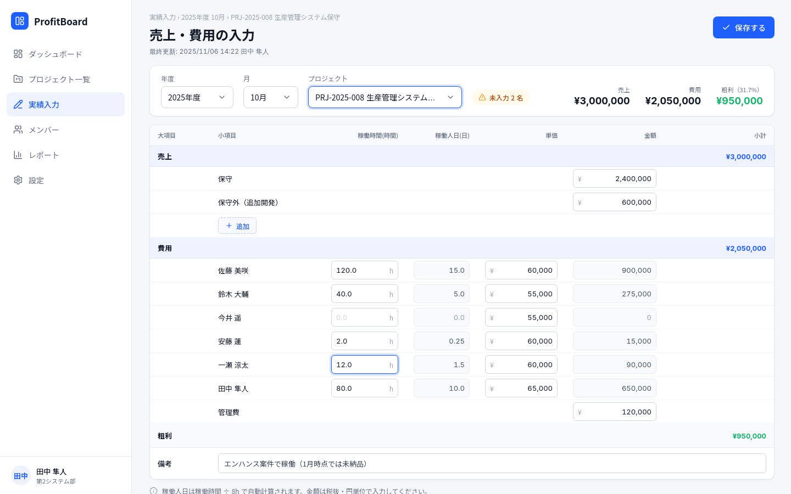
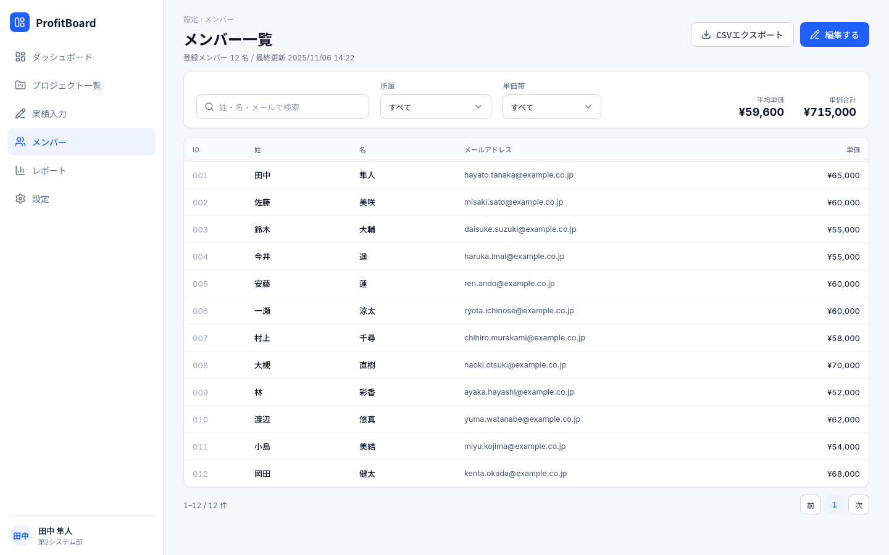
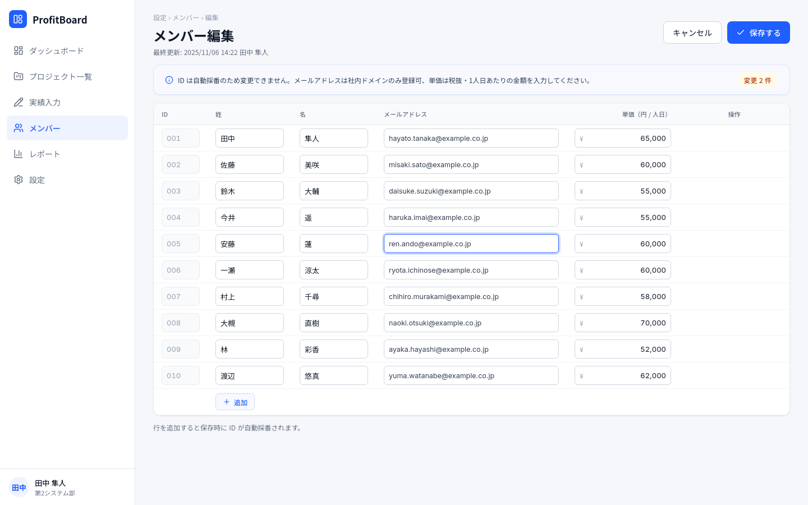
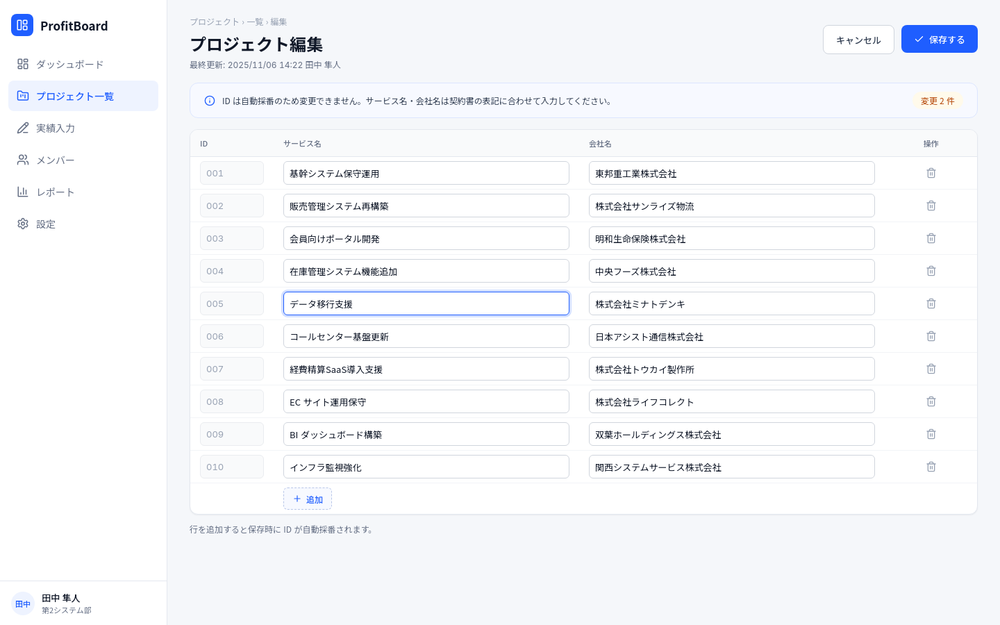

# 要件定義書：ProfitBoard（プロジェクト営業成績管理システム）

## 1. システム概要

### 1.1 目的

SI会社におけるプロジェクトごとの売上・費用・営業利益（営業成績）を可視化し、月次の実績入力および全体の業績モニタリングを効率化するWebアプリケーション。

### 1.2 ターゲットユーザー

SI会社のマネージャー、PM（プロジェクトマネージャー）

### 1.3 開発フェーズ

MVP（Minimum Viable Product）開発

---

## 2. システム構成・技術スタック

| 区分 | 採用技術・サービス | 補足・選定理由 |
| --- | --- | --- |
| **フロントエンド** | Nuxt 3 (TypeScript) | SPAモード / コンポーネント指向・高速開発 |
| **CSS UI** | Tailwind CSS | 公式モジュール (`@nuxtjs/tailwindcss`) 利用 |
| **バックエンド / DB** | Supabase (PostgreSQL) | 公式モジュール (`@nuxtjs/supabase`) 利用 |
| **認証** | Supabase Auth | Google OAuth 2.0 連携 |
| **グラフ描画** | Chart.js | 月次推移の可視化 |
| **ホスティング** | Vercel | GitHub連携による CI/CD 自動デプロイ |
| **ローカル開発環境** | Node.js / Vite | `localhost:3000` 上で `.env` を使用しSupabaseへ直接接続（ホットリロード対応） |

---

## 3. 認証・セキュリティ・アクセス制御

### 3.1 ログイン認証フロー

1. ユーザーが「Googleでログイン」を実行。
2. Supabase Auth 経由で Google OAuth 2.0 認証を完了し、メールアドレスを取得。
3. 取得したメールアドレスを `m_users.email` と照合。
   * **一致する場合**: アプリケーションの利用を許可し、初期画面（ダッシュボード）へ遷移。
   * **一致しない場合**: ログイン不可メッセージを表示し、即座にサインアウト処理を実行。

### 3.2 データベースセキュリティ (RLS)

* Supabase の **Row Level Security (RLS)** を全テーブルで有効化。
* Supabase Auth で認証済み、かつ `m_users` に存在するメールアドレスのユーザーのみ `SELECT`, `INSERT`, `UPDATE` を許可。
* 未認証リクエストおよび許可されていないドメイン/ユーザーからのアクセスはDBレベルで完全に遮断。

---

## 4. 画面一覧および機能要件

### 4.1 ダッシュボード画面 (`/dashboard`)



今年度の全プロジェクトの営業成績を把握するためのメイン画面。

* **年度選択プルダウン**: 選択された年度（デフォルト：今年度）のデータを集計表示。
* **KPIサマリーカード**:
  * 売上高合計（前年同期比 %）
  * 費用合計（前年同期比 %）
  * 営業利益合計（前年同期比 %）
  * 利益率（前年同期比 pt）
  * ※過去データが存在しない場合は、前年同期比に「`-`」を表示。
* **月次推移グラフ**:
  * 売上・費用の棒グラフ＋利益率の折れ線グラフ（複合グラフ）。
* **プロジェクト別 月次営業成績（マトリクス表）**:
  * プロジェクトごとに「売上・費用・粗利・粗利率」の4行を表示。
  * 7月〜翌6月（12ヶ月分）の月次実績を展開（単位：円固定）。
  * 未入力の月は「`-`」を表示。
  * PJ総結合計（年間合計・平均粗利率）を自動計算して表示。
  * プロジェクト名欄に年度比較のステータスバッジ（成長 / 順調 / 注意 / 警告）を表示。選択年度の年間営業利益を前年度と比較して判定する（判定ロジックは6.2節と同じ表を年度単位に適用）。当年度実績のないプロジェクトはバッジを表示しない。前年度実績がない場合は黒字なら「順調」、赤字なら「警告」とする。

### 4.2 プロジェクト営業成績一覧画面 (`/projects`)



全プロジェクトの月次成績を確認・検索する画面。

* **絞り込みフィルター**:
  * 年度プルダウン
  * 月プルダウン
  * ステータスプルダウン（成長 / 順調 / 注意 / 警告）
* **当月KPIサマリー**:
  * 選択月における当月売上、当月費用、営業利益、利益率（前月比表示付き）。
* **プロジェクト一覧テーブル**:
  * 表示項目: プロジェクト名、売上、費用、営業利益、利益率、前月比、ステータスバッジ。
  * アクション: 「プロジェクト編集」ボタン（`/projects/edit` へ遷移）、「実績入力」ボタン（`/performance/input` へ遷移）。

### 4.3 売上・費用実績入力画面 (`/performance/input`)



特定プロジェクト×年月の実績（売上明細・稼働明細・費用）を入力・保存する画面。

* **ヘッダー条件選択**:
  * 年度、月、プロジェクトの各プルダウン選択。
* **サマリー表示**:
  * 入力内容からリアルタイムに売上、費用、粗利（粗利率%）を自動計算・表示。
  * 未入力メンバーが存在する場合のアラート表示。
* **売上入力ブロック**:
  * 小項目ごとの金額入力（初期項目: 「保守」「保守外（追加開発）」）。
  * 行追加機能（ユーザーが任意のテキストで小項目を追加可能）。
* **費用入力ブロック（メンバー別稼働）**:
  * 各メンバーの「稼働時間 (h)」を入力。
  * **稼働人日自動計算**: `稼働時間 ÷ 8`（小数点以下切り捨てまたは適切な桁調整）。
  * **単価**: `m_users.unit_price`（マスタ単価）を初期表示。
  * **金額自動計算**: `稼働人日 × 単価`（または `稼働時間` に基づく計算）。
  * **管理費**: 任意金額を直接手入力する行を用意。
* **備考欄**: フリーテキスト入力。
* **保存機能**: 「保存する」ボタンで `t_sales`, `t_costs`, `t_status` を一括更新/挿入。

### 4.4 メンバー一覧・編集画面





* **メンバー一覧 (`/members`)**:
  * 登録メンバーの一覧表示（ID、姓、名、メールアドレス、単価）。
  * 右上の「編集する」ボタンで編集画面へ遷移。
* **メンバー編集 (`/members/edit`)**:
  * テーブル形式でのインライン一括編集。
  * 項目: ID（自動採番・編集不可）、姓、名、メールアドレス、単価。
  * 行追加ボタン（末尾に新規入力行を追加）。
  * **削除制御**: 過去に一度でも `t_costs`（実績データ）が存在するメンバーの削除（ゴミ箱アイコン押下）は禁止し、エラーアラートを表示する。

### 4.5 プロジェクト編集画面 (`/projects/edit`)



* **プロジェクト編集**:
  * テーブル形式でのインライン一括編集。
  * 項目: ID（自動採番・編集不可）、サービス名、会社名。
  * 行追加ボタン。
  * **削除制御**: 過去に一度でも `t_sales` または `t_costs` が存在するプロジェクトの削除は禁止し、エラーアラートを表示する。

---

## 5. データベース設計 (Supabase / PostgreSQL)

### 5.1 テーブル定義

#### `m_users`（メンバーマスタ）

```sql
CREATE TABLE m_users (
  id SERIAL PRIMARY KEY,
  family_name VARCHAR(50) NOT NULL,
  first_name VARCHAR(50) NOT NULL,
  email VARCHAR(255) UNIQUE NOT NULL,
  unit_price NUMERIC(12, 0) NOT NULL DEFAULT 0,
  created_at TIMESTAMPTZ NOT NULL DEFAULT NOW(),
  updated_at TIMESTAMPTZ NOT NULL DEFAULT NOW()
);
```

#### `m_projects`（プロジェクトマスタ）

```sql
CREATE TABLE m_projects (
  id SERIAL PRIMARY KEY,
  service_name VARCHAR(255) NOT NULL,
  company_name VARCHAR(255) NOT NULL,
  created_at TIMESTAMPTZ NOT NULL DEFAULT NOW(),
  updated_at TIMESTAMPTZ NOT NULL DEFAULT NOW()
);
```

#### `t_sales`（月次売上実績）

```sql
CREATE TABLE t_sales (
  id SERIAL PRIMARY KEY,
  fiscal_year INT NOT NULL,
  month INT NOT NULL,
  project_id INT NOT NULL REFERENCES m_projects(id),
  category_small VARCHAR(100) NOT NULL,
  amount NUMERIC(12, 0) NOT NULL DEFAULT 0,
  created_at TIMESTAMPTZ NOT NULL DEFAULT NOW(),
  updated_at TIMESTAMPTZ NOT NULL DEFAULT NOW()
);
```

#### `t_costs`（月次費用実績）

```sql
CREATE TABLE t_costs (
  id SERIAL PRIMARY KEY,
  fiscal_year INT NOT NULL,
  month INT NOT NULL,
  project_id INT NOT NULL REFERENCES m_projects(id),
  user_id INT REFERENCES m_users(id), -- NULLの場合は管理費等
  cost_type VARCHAR(50) NOT NULL DEFAULT 'LABOR', -- 'LABOR' or 'MANAGEMENT'
  work_hours NUMERIC(6, 2) DEFAULT 0,
  work_days NUMERIC(6, 2) DEFAULT 0,
  unit_price NUMERIC(12, 0) DEFAULT 0,
  amount NUMERIC(12, 0) NOT NULL DEFAULT 0,
  created_at TIMESTAMPTZ NOT NULL DEFAULT NOW(),
  updated_at TIMESTAMPTZ NOT NULL DEFAULT NOW()
);
```

#### `t_status`（月次ステータス・備考）

```sql
CREATE TABLE t_status (
  id SERIAL PRIMARY KEY,
  fiscal_year INT NOT NULL,
  month INT NOT NULL,
  project_id INT NOT NULL REFERENCES m_projects(id),
  remark TEXT,
  updated_by VARCHAR(255),
  created_at TIMESTAMPTZ NOT NULL DEFAULT NOW(),
  updated_at TIMESTAMPTZ NOT NULL DEFAULT NOW(),
  UNIQUE(fiscal_year, month, project_id)
);
```

---

## 6. ロジック・計算仕様

### 6.0 会計年度の定義

* **年度は7月始まり**（6月決算）。「2026年度」は **2026年7月〜2027年6月** を指す（開始年で呼ぶ）。
* `t_sales` / `t_costs` / `t_status` の `fiscal_year` はこの年度、`month` は暦月（1〜12）を保持する。
  したがって年度2026の `month = 1` は暦2027年1月を意味する。
* 開始月は `lib/fiscalYear.ts` の `FISCAL_START_MONTH` 1ヶ所で定義され、
  月の並び・年度⇔暦年変換・前年同期比はすべてこれを参照する。

### 6.1 自動計算ロジック

1. **稼働人日**: `work_days = work_hours / 8.0`
2. **人件費**: `amount = work_days * unit_price`
3. **売上合計**: `total_sales = SUM(t_sales.amount)`
4. **費用合計**: `total_costs = SUM(t_costs.amount)`
5. **営業利益（粗利）**: `gross_profit = total_sales - total_costs`
6. **利益率（粗利率）**: `profit_rate = (gross_profit / total_sales) * 100` （売上ゼロの場合は0%）

### 6.2 ステータス自動判定ロジック

対象月および前月の営業利益（黒字: 0以上, 赤字: 0未満）と前月比の差分に基づき、以下の表に従って自動判定する。

| ステータス | バッジ色 | 当月利益 | 前月比（利益の差分） |
| --- | --- | --- | --- |
| **成長** | 緑 (`#22C55E`) | 黒字 (>= 0) | プラス (> 0) |
| **順調** | 緑 (`#22C55E`) | 黒字 (>= 0) | 一致またはマイナス (<= 0) |
| **注意** | 黄 (`#EAB308`) | 赤字 (< 0) | プラス (> 0) |
| **警告** | 赤 (`#EF4444`) | 赤字 (< 0) | 一致またはマイナス (<= 0) |

* **前月データが存在しない場合（年度初月等）**:
  * 黒字 (>= 0) の場合 ➔ **順調**
  * 赤字 (< 0) の場合 ➔ **警告**

---

## 7. 初期設定・環境構築要件

1. **初期管理者ユーザーのセットアップ**:
   * アプリケーション初回起動前に、管理者（マネージャー）の Google アカウントメールアドレスを `m_users` テーブルへ直に手動インサート（またはSupabase SQL Editorで実行）しておく。
2. **Vercel デプロイ**:
   * Supabase の `SUPABASE_URL` および `SUPABASE_KEY`（Anon Key）を Vercel の環境変数（Environment Variables）に設定しビルド・デプロイを行う。
